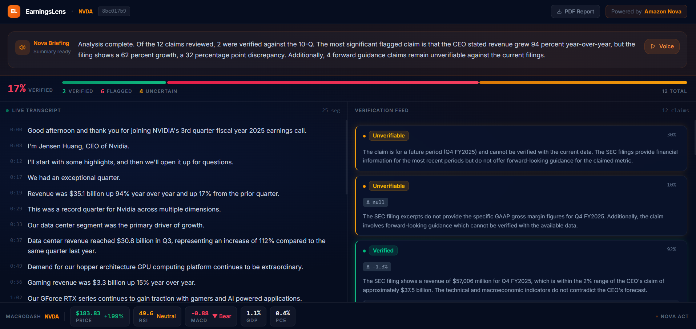

# EarningsLens

**Real-time AI fact-checking for earnings calls — built on Amazon Nova.**

While a CEO speaks, EarningsLens extracts every numerical claim and fires a simultaneous triple cross-reference against SEC filings, live technical indicators, and macroeconomic data. Nova 2 Sonic delivers an interactive voice briefing when the call ends.

Built for the [Amazon Nova AI Hackathon](https://devpost.com/software/earningslens).

---

## Demo



---

## How It Works

```
Earnings call audio
        │
        ▼
  AWS Transcribe ──► rolling transcript
        │
        ▼
  Nova 2 Lite ──► claim extraction
  {"metric": "data_center_revenue", "value": "35.1B", "period": "Q3 FY2025"}
        │
        ├──► SEC Filing (Nova Multimodal Embeddings vector store)
        ├──► Technical Indicators (MacroDash: RSI, MACD, Bollinger Bands)
        └──► FRED Macro Data (MacroDash: GDP, PCE, CPI, unemployment)
                │
                ▼
          Nova 2 Lite verdict: VERIFIED / FLAGGED / UNVERIFIABLE
                │
                ▼
         Live dashboard (SSE stream) + JSON/PDF report
                │
                ▼
         Nova 2 Sonic voice briefing + interactive Q&A
```

---

## Nova Components

| Model | Role |
|---|---|
| **Nova 2 Lite** (`amazon.nova-lite-v1:0`) | Claim extraction, triple-source verification reasoning, briefing text generation |
| **Nova Act** | Autonomously navigates SEC EDGAR to locate and download 10-Q/10-K filings |
| **Nova Multimodal Embeddings** (`amazon.nova-2-multimodal-embeddings-v1:0`) | Indexes full SEC PDF including charts, tables, and text for semantic search |
| **Nova 2 Sonic** (`amazon.nova-2-sonic-v1:0`) | Bidirectional speech-to-speech post-call briefing and interactive Q&A |

---

## Verification Logic

For each extracted claim:

- **SEC Filing check** — semantic query against the Nova Multimodal Embeddings vector store
  - Delta > 2 percentage points → `FLAGGED`
- **Technical indicator check** — live RSI, MACD, Bollinger Bands via MacroDash
  - Bearish divergence alongside bullish claim → `CONTEXT FLAG`
- **Macro check** — FRED GDP, PCE, CPI, unemployment via MacroDash
  - Macro data contradicts demand claim → `CONTEXT FLAG`

**Verdicts:** `VERIFIED` · `FLAGGED` · `UNVERIFIABLE` · `CONTEXT`

---

## Tech Stack

- **Backend**: Python 3.12, FastAPI, boto3, uv
- **Frontend**: React + TypeScript, Vite
- **Transcription**: AWS Transcribe
- **AI**: Amazon Bedrock (Nova 2 Lite, Nova Act, Nova Multimodal Embeddings, Nova 2 Sonic)
- **Market Data**: [MacroDash](https://macrodash.xyz) APIs (Yahoo Finance, Alpha Vantage, FRED, TA-Lib)
- **Vector Store**: In-memory cosine similarity (numpy)

---

## Setup

### Prerequisites

- Python 3.12+
- Node.js 18+
- AWS account with Bedrock access (us-east-1)
- `uv` package manager (`pip install uv`)

### Backend

```bash
uv venv .venv
source .venv/bin/activate        # Windows: .venv\Scripts\activate
uv pip install -r backend/requirements.txt
```

Create `.env` in the project root:

```env
AWS_ACCESS_KEY_ID=your_key
AWS_SECRET_ACCESS_KEY=your_secret
AWS_REGION=us-east-1
BEDROCK_REGION=us-east-1
S3_BUCKET=earningslens-demo
REDIS_URL=redis://localhost:6379
MACRODASH_BASE_URL=https://macrodash-server.5249c0fmwzjkc.us-east-1.cs.amazonlightsail.com
```

```bash
uvicorn backend.main:app --reload --port 8000
```

### Frontend

```bash
cd frontend
npm install
npm run dev
```

App runs at `http://localhost:5173`.

---

## API Endpoints

```
POST /session/start                  — create session, returns session_id
POST /session/{id}/upload-audio      — ingest audio, trigger AWS Transcribe
POST /filing/fetch                   — Nova Act downloads 10-Q for ticker
POST /filing/embed                   — embed PDF with Nova Multimodal Embeddings
GET  /session/{id}/stream            — SSE stream of live verification results
POST /session/{id}/end               — trigger Nova 2 Sonic briefing
GET  /session/{id}/briefing          — briefing text + audio URL
GET  /session/{id}/report.json       — full structured report
GET  /session/{id}/report.pdf        — PDF report
```

---

## Project Structure

```
earningslens-nova/
├── backend/
│   ├── api/            # FastAPI route handlers
│   ├── audio/          # AWS Transcribe + Redis audio store
│   ├── briefing/       # Nova 2 Sonic TTS
│   ├── embedding/      # Nova Multimodal Embeddings + vector store
│   ├── filing/         # Nova Act EDGAR navigator
│   ├── macrodash/      # MacroDash API client
│   ├── report/         # JSON + PDF exporters
│   ├── verification/   # Claim extractor + triple verifier
│   └── main.py
├── frontend/
│   └── src/
│       ├── components/ # TranscriptPanel, VerificationFeed, VoiceQA, ...
│       └── pages/      # SonicDemo
├── data/               # (gitignored) audio, vectorstore cache
└── design.png
```

---

## Team

Built by Hariharan for the Amazon Nova AI Hackathon.

MacroDash — the financial dashboard powering the market data layer — is the team's prior production project.
